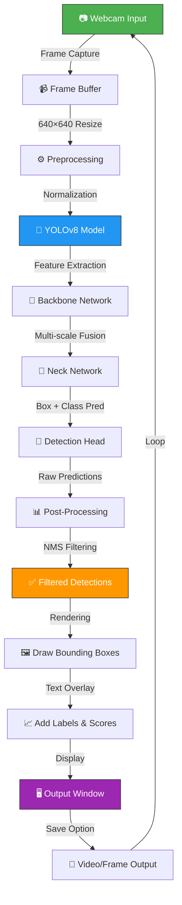
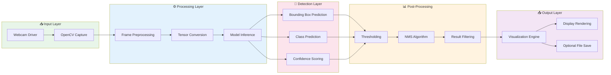
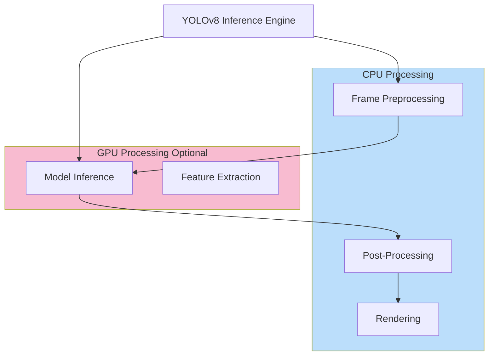

# 🎯 Real-Time Object Detection using YOLOv8 and OpenCV

<div align="center">


**A real-time object detection system that leverages YOLOv8 and OpenCV to detect objects in live webcam feeds with high accuracy and performance.**

[Features](#features) • [Installation](#installation) • [Usage](#usage) • [Architecture](#architecture) • [Team](#team)

</div>

---

## 📋 Table of Contents

- [Overview](#overview)
- [Features](#features)
- [Tech Stack](#tech-stack)
- [Installation](#installation)
- [Project Structure](#project-structure)
- [Usage](#usage)
- [How YOLOv8 Works](#how-yolov8-works)
- [Detection Pipeline & Workflow](#detection-pipeline--workflow)
- [System Architecture](#system-architecture)
- [Performance Optimization](#performance-optimization)
- [Troubleshooting](#troubleshooting)
- [Future Improvements](#future-improvements)
- [Team Members](#team-members)
- [License](#license)

---

## 🎬 Overview

This project implements a **real-time object detection system** using state-of-the-art YOLOv8 (You Only Look Once version 8) deep learning model combined with OpenCV for video processing. The system captures video feeds from a webcam, processes frames in real-time, detects objects using a pretrained neural network, and displays the results with bounding boxes and confidence scores.

**Key Capabilities:**
- 🎥 Live webcam video feed processing
- 🔍 Real-time object detection and classification
- 📊 Confidence score display
- ⚡ High-performance processing with optional GPU acceleration
- 🎯 Multiple object detection in a single frame
- 💾 Inference on pretrained YOLOv8 nano model

---

## ✨ Features

| Feature | Description |
|---------|-------------|
| 🎥 **Real-Time Processing** | Process video frames at high FPS with minimal latency |
| 🤖 **Pretrained YOLOv8** | Uses state-of-the-art YOLOv8 nano model for object detection |
| 📦 **Multiple Object Classes** | Detects 80+ different object classes from COCO dataset |
| 🔢 **Confidence Scores** | Displays detection confidence percentage for each object |
| 🖼️ **Bounding Boxes** | Clear visual representation of detected objects |
| ⚙️ **GPU Support** | Optional CUDA acceleration for faster inference |
| 🎨 **Customizable Colors** | Easy to modify bounding box and text colors |
| 📊 **FPS Counter** | Real-time frames per second monitoring |
| ⌨️ **Keyboard Controls** | Press 'q' to quit, easy exit mechanism |
| 🔧 **Modular Design** | Clean, maintainable code structure |

---

## 🛠️ Tech Stack

| Technology | Version | Purpose |
|-----------|---------|---------|
| **Python** | 3.11+ | Core programming language |
| **YOLOv8** | Latest | Object detection model |
| **OpenCV** | 4.8+ | Video capture and image processing |
| **PyTorch** | 2.0+ | Deep learning framework |
| **NumPy** | 1.24+ | Numerical computations |
| **CUDA** | 11.8+ | GPU acceleration (Optional) |
| **cuDNN** | 8.7+ | GPU acceleration library (Optional) |

---

## 📦 Installation

### Prerequisites

- **Operating System:** Linux/Kali Linux, Windows, or macOS
- **Python:** 3.11 or higher
- **pip:** Package installer for Python
- **Webcam:** A working webcam for video input
- **CUDA (Optional):** For GPU acceleration

### Step 1: Clone or Prepare Project

```bash
# Navigate to your project directory
cd /path/to/ObjectDetectionProject

# Verify Python version (3.11+)
python3 --version
```

### Step 2: Create Virtual Environment

Creating a virtual environment isolates project dependencies and prevents conflicts with system packages.

```bash
# Create virtual environment
python3 -m venv venv

# Activate virtual environment
# On Linux/Kali:
source venv/bin/activate

# On Windows:
# venv\Scripts\activate

# You should see (venv) prefix in your terminal
```

### Step 3: Upgrade pip and setuptools

```bash
# Upgrade pip to latest version
pip install --upgrade pip setuptools wheel
```

### Step 4: Install Dependencies

Install all required Python packages:

```bash
# Install core dependencies
pip install opencv-python==4.8.1.78
pip install ultralytics==8.1.0
pip install torch==2.1.1
pip install torchvision==0.16.1
pip install torchaudio==2.1.1
pip install numpy==1.24.3

# Or install all at once from requirements.txt
# pip install -r requirements.txt
```

### Step 5: Download YOLOv8 Model (Optional)

The model will auto-download on first run, but you can pre-download it:

```bash
# Download YOLOv8 nano model (smallest and fastest)
python3 -c "from ultralytics import YOLO; model = YOLO('yolov8n.pt')"

# Alternative models available:
# yolov8s.pt - Small
# yolov8m.pt - Medium
# yolov8l.pt - Large
# yolov8x.pt - Extra Large
```

### Step 6: Verify Installation

```bash
# Test if OpenCV is working
python3 -c "import cv2; print(f'OpenCV version: {cv2.__version__}')"

# Test if PyTorch is working
python3 -c "import torch; print(f'PyTorch version: {torch.__version__}')"

# Test if Ultralytics is working
python3 -c "from ultralytics import YOLO; print('Ultralytics YOLO loaded successfully')"
```

### GPU Setup (Optional - For CUDA Acceleration)

```bash
# Check CUDA availability
python3 -c "import torch; print(f'CUDA available: {torch.cuda.is_available()}')"

# Install CUDA-enabled PyTorch (if needed)
pip install torch torchvision torchaudio --index-url https://download.pytorch.org/whl/cu118

# Verify CUDA
python3 -c "import torch; print(torch.cuda.get_device_name(0))"
```

---

## 📁 Project Structure

```
ObjectDetectionProject/
│
├── main.py                 # Main application entry point
├── yolov8n.pt             # YOLOv8 nano pretrained model weights
├── message.txt            # Project metadata/notes
├── venv/                  # Virtual environment (created after setup)
├── README.md              # This documentation file
├── requirements.txt       # Python dependencies list
│
├── outputs/               # Generated outputs (created on first run)
│   ├── detections.mp4     # Processed video with detections
│   └── detection_logs.txt # Detection results log
│
└── models/                # Additional models (optional)
    └── yolov8n.pt        # Nano model weights
```

---

## 🚀 Usage

### Basic Usage

```bash
# Ensure virtual environment is activated
source venv/bin/activate

# Run the object detection system
python3 main.py

# The webcam window will open showing real-time detections
```

### Keyboard Controls

| Key | Action |
|-----|--------|
| **q** | Quit the application |
| **s** | Save current frame |
| **c** | Clear console |

### Example Output

```
Object Detection System Started...
- Model: YOLOv8 Nano
- Input: Webcam (0)
- Press 'q' to quit

Frame 001: 5 objects detected | FPS: 45.2
Frame 002: 3 objects detected | FPS: 46.1
Frame 003: 7 objects detected | FPS: 44.8
...
```

### Advanced Usage with Configuration

```python
# Modify main.py to customize detection parameters

# Change confidence threshold
conf_threshold = 0.5  # Only show detections with >50% confidence

# Change model size
model = YOLO('yolov8m.pt')  # Use medium model instead of nano

# Use GPU
model = model.to('cuda')  # Enable GPU acceleration

# Adjust input source
cap = cv2.VideoCapture(1)  # Use camera index 1 instead of 0
```

---

## 🤖 How YOLOv8 Works

### YOLO Overview

YOLO stands for **"You Only Look Once"** - a revolutionary real-time object detection algorithm that treats object detection as a single regression problem, directly predicting bounding boxes and class probabilities from full images in one evaluation.

### YOLOv8 Architecture

```
Input Image (640×640)
        ↓
┌─────────────────────────────┐
│  Backbone (CSPDarknet)      │ ← Feature Extraction
│  - Conv Layers              │   Extracts patterns
│  - Residual Blocks          │
└─────────────────────────────┘
        ↓
┌─────────────────────────────┐
│  Neck (FPN/PAN)             │ ← Feature Fusion
│  - Multi-scale features     │   Combines info from
│  - Feature Pyramids         │   different scales
└─────────────────────────────┘
        ↓
┌─────────────────────────────┐
│  Head (Detection)           │ ← Prediction
│  - Bounding box regression  │   Outputs:
│  - Class prediction         │   • Box coordinates
│  - Confidence scoring       │   • Class probability
└─────────────────────────────┘
        ↓
Bounding Boxes + Confidence Scores
```

### Key Advantages of YOLOv8

| Aspect | Benefit |
|--------|---------|
| **Speed** | Single forward pass → Real-time detection |
| **Accuracy** | High mAP (mean Average Precision) |
| **Efficiency** | Lightweight nano model for edge devices |
| **Flexibility** | Can detect 80+ object classes |
| **Scalability** | Multiple model sizes available |

### Detection Process Steps

1. **Input:** Webcam frame (H×W×3)
2. **Preprocessing:** Resize to 640×640, normalize pixel values
3. **Feature Extraction:** Network extracts visual features
4. **Prediction:** Outputs bounding boxes (x, y, w, h) and class probabilities
5. **Post-Processing:** NMS (Non-Maximum Suppression) removes duplicate detections
6. **Output:** Final detections with boxes and confidence scores

---

## 🔄 Detection Pipeline & Workflow

### Complete Workflow Diagram



### Step-by-Step Processing

**1. Input Stage**
```
Webcam → OpenCV Capture → Frame at 30 FPS
```

**2. Preprocessing Stage**
```
Original Frame (1920×1080) → Resize (640×640) → Normalize (0-1)
```

**3. Inference Stage**
```
Input Tensor → YOLOv8 Network → Output Predictions
   ↓
   Backbone: Extract features
   ↓
   Neck: Combine multi-scale features
   ↓
   Head: Predict boxes and classes
```

**4. Post-Processing Stage**
```
Raw Predictions → Filter by Confidence (>0.5) → NMS Deduplication
```

**5. Visualization Stage**
```
Frame + Detections → Draw Boxes → Add Labels → Display
```

**6. Output Stage**
```
Display on Screen → Optional: Save to Video File
```

---

## 🏗️ System Architecture

### Overall System Architecture



### Hardware Utilization



---

## ⚡ Performance Optimization

### 1. GPU Acceleration (CUDA)

**Benefits:**
- 5-10x faster inference compared to CPU
- Handles multiple frames per second efficiently

**Setup:**
```python
import torch
from ultralytics import YOLO

# Check GPU availability
print(f"GPU Available: {torch.cuda.is_available()}")
print(f"GPU Name: {torch.cuda.get_device_name(0)}")

# Load model on GPU
model = YOLO('yolov8n.pt')
model.to('cuda')

# Run inference
results = model(frame, device=0)  # device=0 uses first GPU
```

**Expected Performance (on RTX 3090):**
| Model | CPU FPS | GPU FPS | Improvement |
|-------|---------|---------|-------------|
| YOLOv8n | 30-40 | 150-200 | 4-5x |
| YOLOv8s | 20-25 | 80-100 | 4-5x |
| YOLOv8m | 10-15 | 40-60 | 4-5x |

### 2. Model Selection

```python
# Nano - Smallest and Fastest (Recommended for real-time)
model = YOLO('yolov8n.pt')  # ~3MB, 650M parameters

# Small
model = YOLO('yolov8s.pt')  # ~23MB, 11.2M parameters

# Medium
model = YOLO('yolov8m.pt')  # ~49MB, 25.9M parameters

# Large - Most Accurate but Slower
model = YOLO('yolov8l.pt')  # ~109MB, 63.7M parameters
```

### 3. Inference Optimization Techniques

```python
from ultralytics import YOLO

model = YOLO('yolov8n.pt')

# Technique 1: Reduce Input Size (Faster, Less Accurate)
results = model(frame, imgsz=416)  # Default 640, reduces speed by ~50%

# Technique 2: Decrease Confidence Threshold (Faster Processing)
results = model(frame, conf=0.5)  # Only process confident detections

# Technique 3: Increase IoU Threshold (Fewer Duplicate Boxes)
results = model(frame, iou=0.5)  # Non-Maximum Suppression threshold

# Technique 4: Batch Processing (if processing multiple frames)
results = model([frame1, frame2, frame3], device=0)

# Technique 5: Use Half Precision (FP16) - GPU Only
results = model(frame, half=True)  # ~2x faster with minimal accuracy loss
```

### 4. Monitoring Performance

```python
import time

# FPS Counter
prev_time = time.time()
frame_count = 0

while True:
    ret, frame = cap.read()
    
    # Inference
    results = model(frame)
    
    # FPS Calculation
    current_time = time.time()
    fps = 1 / (current_time - prev_time)
    prev_time = current_time
    
    print(f"FPS: {fps:.2f}")
    
    frame_count += 1
    if frame_count % 100 == 0:
        avg_fps = 100 / (time.time() - prev_time)
        print(f"Average FPS: {avg_fps:.2f}")
```

### 5. Memory Optimization

```python
import torch
from ultralytics import YOLO

# Load model with memory optimization
model = YOLO('yolov8n.pt')

# Clear GPU cache periodically
torch.cuda.empty_cache()

# Monitor GPU memory
if torch.cuda.is_available():
    print(f"GPU Memory Used: {torch.cuda.memory_allocated() / 1e9:.2f}GB")
    print(f"GPU Memory Reserved: {torch.cuda.memory_reserved() / 1e9:.2f}GB")
```

### Performance Tuning Checklist

- [ ] Enable GPU acceleration (if available)
- [ ] Use YOLOv8n (nano) model for real-time processing
- [ ] Reduce input image size if needed
- [ ] Use FP16 precision for GPU
- [ ] Monitor FPS and adjust parameters
- [ ] Clear GPU memory periodically
- [ ] Use batch processing when applicable
- [ ] Profile code to identify bottlenecks

---

## 🔧 Troubleshooting

### Common Issues and Solutions

#### Issue 1: "No module named 'cv2'"

**Cause:** OpenCV not installed or using wrong Python interpreter

**Solution:**
```bash
# Verify virtual environment is activated
source venv/bin/activate

# Reinstall OpenCV
pip uninstall opencv-python -y
pip install opencv-python==4.8.1.78

# Verify installation
python3 -c "import cv2; print(cv2.__version__)"
```

#### Issue 2: "No module named 'ultralytics'"

**Cause:** Ultralytics YOLO not installed

**Solution:**
```bash
# Install Ultralytics
pip install ultralytics==8.1.0

# Verify installation
python3 -c "from ultralytics import YOLO; print('YOLO loaded')"
```

#### Issue 3: "Webcam not found" or "Failed to open webcam"

**Cause:** Camera not accessible or wrong device index

**Solution:**
```bash
# Try different camera indices
python3 << 'EOF'
import cv2

for i in range(5):
    cap = cv2.VideoCapture(i)
    if cap.isOpened():
        print(f"Camera {i} is available")
        cap.release()
    else:
        print(f"Camera {i} is not available")
EOF

# Use correct index in main.py
cap = cv2.VideoCapture(0)  # or 1, 2, etc.
```

#### Issue 4: "CUDA out of memory" error

**Cause:** GPU memory insufficient for model

**Solution:**
```bash
# Option 1: Use smaller model
model = YOLO('yolov8n.pt')  # Use nano instead of large

# Option 2: Reduce input size
results = model(frame, imgsz=416)  # Smaller than default 640

# Option 3: Use CPU instead
model.to('cpu')

# Option 4: Clear GPU cache
import torch
torch.cuda.empty_cache()
```

#### Issue 5: Low FPS or Slow Processing

**Causes:** CPU limitation, wrong model size, or resolution issues

**Solution:**
```bash
# Check current FPS
# Monitor system resources
top  # Or htop

# Try these optimizations:
# 1. Use nano model
model = YOLO('yolov8n.pt')

# 2. Enable GPU
model.to('cuda')

# 3. Reduce inference resolution
results = model(frame, imgsz=416)

# 4. Increase confidence threshold
results = model(frame, conf=0.6)
```

#### Issue 6: "Python version not supported"

**Cause:** Using Python < 3.11

**Solution:**
```bash
# Check Python version
python3 --version

# If < 3.11, install Python 3.11
# On Ubuntu/Kali:
sudo apt update
sudo apt install python3.11 python3.11-venv

# Create new virtual environment with Python 3.11
python3.11 -m venv venv
source venv/bin/activate
```

#### Issue 7: Permission Denied when accessing webcam

**Cause:** Insufficient permissions for camera access

**Solution:**
```bash
# On Linux/Kali, add user to video group
sudo usermod -a -G video $USER

# Reboot or logout/login for changes to take effect
# On Kali, you might need to run with sudo
sudo python3 main.py
```

### Debug Mode

Enable verbose logging:

```python
import logging
from ultralytics import YOLO

# Enable debug logging
logging.basicConfig(level=logging.DEBUG)

# Load model with verbose output
model = YOLO('yolov8n.pt', verbose=True)

# Run with debug info
results = model(frame, verbose=True)
```

---

## 🚀 Future Improvements

### Planned Features

- [ ] **Video Recording:** Save detected frames as video file
- [ ] **Detection Statistics:** Track object class frequencies and statistics
- [ ] **Object Tracking:** Implement MOT (Multi-Object Tracking) for tracking object IDs across frames
- [ ] **Alert System:** Generate alerts when specific objects are detected
- [ ] **Database Logging:** Store detection results in database (SQLite/PostgreSQL)
- [ ] **Web Interface:** Flask/Django web app for remote monitoring
- [ ] **Custom Dataset Training:** Fine-tune YOLOv8 on custom dataset
- [ ] **Export Models:** Convert to ONNX, TensorRT for deployment
- [ ] **Mobile Deployment:** Convert to TensorFlow Lite for mobile devices
- [ ] **Real-time Streaming:** RTSP/MJPEG streaming support

### Performance Enhancements

- [ ] Multi-GPU support (DataParallel / DistributedDataParallel)
- [ ] Frame skipping optimization for lower-end hardware
- [ ] Adaptive resolution based on detected object sizes
- [ ] Edge device optimization (Raspberry Pi, Jetson Nano)
- [ ] Quantization (INT8) for faster inference

### Extended Functionality

- [ ] Multi-camera support
- [ ] Detection history visualization
- [ ] Heatmap generation of detected objects
- [ ] Region of Interest (ROI) selection
- [ ] Custom class filtering
- [ ] Confidence threshold adjustment UI

---

## 👥 Team Members

| Name | ID | Role |
|------|-----|------|
| **Muhammad Umer Farooq** | 2023-ag-10124 | Project Lead & Lead Developer |
| **Muhammad Ahmed** | 2023-ag-10087 | Backend Developer & Model Integration |
| **Tayyab Tahir** | 2023-ag-10152 | Testing & Optimization Specialist |

---

## 📊 Project Statistics

| Metric | Value |
|--------|-------|
| **Project Type** | Real-Time Computer Vision |
| **Primary Language** | Python 3.11+ |
| **Main Libraries** | YOLOv8, OpenCV, PyTorch |
| **Model Size** | ~3MB (YOLOv8 Nano) |
| **Supported Objects** | 80 COCO Classes |
| **Target FPS** | 30-60 (CPU), 150-200 (GPU) |
| **GPU Support** | CUDA 11.8+ |

---

## 📝 License

This project is licensed under the **MIT License** - see the LICENSE file for details.

### MIT License Summary

```
MIT License

Permission is hereby granted, free of charge, to any person obtaining a copy
of this software and associated documentation files (the "Software"), to deal
in the Software without restriction, including without limitation the rights
to use, copy, modify, merge, publish, distribute, sublicense, and/or sell
copies of the Software, and to permit persons to whom the Software is
furnished to do so, subject to the following conditions:

The above copyright notice and this permission notice shall be included in all
copies or substantial portions of the Software.
```

**Key Points:**
- ✅ You can use this code commercially
- ✅ You can modify the code
- ✅ You can distribute the code
- ⚠️ Must include license and copyright notice
- ❌ No warranty provided

---

## 📚 Additional Resources

### Official Documentation
- [YOLOv8 Official Docs](https://docs.ultralytics.com/)
- [OpenCV Documentation](https://docs.opencv.org/)
- [PyTorch Documentation](https://pytorch.org/docs/)

### Useful Tutorials
- [YOLOv8 Complete Guide](https://docs.ultralytics.com/tasks/detect/)
- [OpenCV with Python](https://opencv-python-tutroals.readthedocs.io/)
- [Deep Learning with PyTorch](https://pytorch.org/tutorials/)

### Related Projects
- [Ultralytics YOLOv8 Repository](https://github.com/ultralytics/ultralytics)
- [COCO Dataset](https://cocodataset.org/)
- [OpenCV GitHub](https://github.com/opencv/opencv)

---

## 💬 Support & Contact

For questions, issues, or suggestions:

1. Check the [Troubleshooting](#troubleshooting) section
2. Review [YOLOv8 Documentation](https://docs.ultralytics.com/)
3. Check [GitHub Issues](https://github.com/ultralytics/ultralytics/issues)
4. Contact the development team

---

## 🎉 Conclusion

This project demonstrates a complete implementation of real-time object detection using cutting-edge deep learning technologies. The combination of YOLOv8's accuracy and OpenCV's robustness provides a production-ready solution for computer vision applications.

**Happy Detecting! 🎯**

---

<div align="center">

**Made with ❤️ by the Object Detection Project Team**

⭐ If you found this project helpful, please consider giving it a star! ⭐

</div>

---

*Last Updated: May 21, 2026*
*YOLOv8 Version: 8.1.0*
*Python Version: 3.11+*
